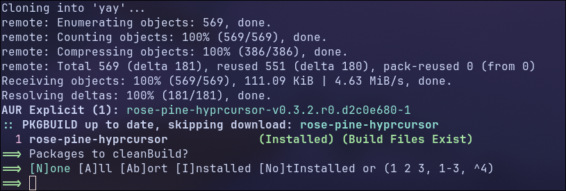

# Quickshell-rice

A personal Linux desktop setup for Arch Linux, Hyprland, and Quickshell. This repository contains the desktop shell and configs for the terminal, prompt, system information tools, and lock screen.

The setup is a work in progress. See [Roadmap](#roadmap) for planned features.

## What's included

- **Quickshell:** a bar with workspaces, clock, audio and music controls, Cava, and system resource usage; an app launcher; notifications; screenshots; and a wallpaper picker.
- **Hyprland:** window rules, keyboard shortcuts, Spotify and Discord scratchpads, and a Hyprlock config.
- **Wallpaper colors:** a Python script that derives an accent color for Quickshell, Hyprland borders and shadows, and Hyprlock.
- **Terminal:** Ghostty with cursor shaders, Fish, and a Starship prompt.
- **System tools:** Fastfetch, btop, and Cava configs.

## Before installing

Use an existing Arch Linux installation with a working Hyprland session. The Hyprland config in this repository uses Lua (`hypr/hyprland.lua`); your Hyprland installation must support that configuration format.

These are personal configs, so monitor names, application choices, and home-directory paths need adjusting. Back up any existing configs you want to keep: the copy commands below overwrite matching files.

Run the installation commands in **Bash**. Other distributions need equivalent packages installed with their own package manager.

## Installation

### 1. Install dependencies

Install the applications used by the setup, plus screenshot, audio, brightness, media, and wallpaper-color tools:

```bash
sudo pacman -S --needed quickshell ghostty hyprlock ly fish fastfetch \
  ttf-jetbrains-mono-nerd nautilus zed starship firefox \
  grim slurp hyprpicker wl-clipboard cliphist xdg-utils util-linux wireplumber brightnessctl playerctl cava python \
  xorg-xrandr git base-devel
```

Optional packages: `btop` for the included system-tool config, and Spotify and Discord for their scratchpad shortcuts.

The cursor theme is installed from the AUR. If you already have `yay`, skip its build commands:

```bash
git clone https://aur.archlinux.org/yay.git
cd yay
makepkg -si
cd ..
yay -S rose-pine-hyprcursor
```

Read package-manager prompts before accepting them. Press Enter when the displayed default is the option you want.



### 2. Copy the configs

Clone the repository, then copy only the configuration directories and Starship config into `~/.config`:

```bash
git clone https://github.com/sulfurlinux/Quickshell-rice.git
cd Quickshell-rice
mkdir -p "$HOME/.config"
cp -r hypr quickshell ghostty fish fastfetch btop cava "$HOME/.config/"
cp starship.toml "$HOME/.config/"
```

Keep the cloned repository if you want to pull updates or edit the source later.

### 3. Personalize paths and hardware settings

Edit the copied files in `~/.config` before loading the setup:

| File                                                     | What to adjust                                                                                        |
| -------------------------------------------------------- | ----------------------------------------------------------------------------------------------------- |
| `hypr/modules/monitors.lua`                              | Monitor names, resolutions, refresh rates, and positions. Run `hyprctl monitors` to see your outputs. |
| `hypr/modules/autostart.lua` and `quickshell/shell.qml`  | The `DP-1` primary-monitor setting, if your output has a different name.                              |
| `hypr/modules/input.lua` and `hypr/modules/programs.lua` | Keyboard layout, mouse settings, and preferred applications.                                          |
| `quickshell/modules/wallpaper.py`                        | Uses your home directory automatically. Customize the default wallpaper filename here if needed.      |
| `fish/config.fish` and `fish/fish_variables`             | Remove or adapt the personal Spicetify paths if you do not use them.                                  |

Create the user folders and the Python environment used by the wallpaper-color script:

```bash
mkdir -p "$HOME"/{Desktop,Documents,Downloads,Music,Pictures/Wallpapers,Videos}
python3 -m venv "$HOME/.cache/quickshell_venv"
"$HOME/.cache/quickshell_venv/bin/python3" -m pip install Pillow
```

Put a wallpaper at `~/Pictures/Wallpapers/wallpaper.png`, or choose an image from `/wallpaper` in the launcher. The saved selection is restored at startup; if no valid image is available, a solid background is shown.

One selection updates every display. A single color extractor updates the Quickshell theme as soon as it finishes; selecting another wallpaper cancels the previous extraction and ignores stale results.

Wallpaper images use Qt's shared image cache and a common decode size based on the active displays' physical resolution. Large source images are bounded to that size and loaded asynchronously.

Wallpaper accents are cached for up to 128 images in `~/.cache/quickshell_wallpaper_colors.json`. Switching back to an unchanged image reuses its accent without importing Pillow or decoding the image. Modified or replaced files are recalculated automatically; the cache survives Quickshell restarts.

Hyprland's active border gradient, muted inactive border, and shadow tint follow the same accent. Changes apply live through `hyprctl eval`; the saved palette in `~/.cache/hyprland_colors.txt` is restored by `hypr/modules/lookandfeel/theme.lua` on startup and configuration reload.

Generate the initial theme files used by Quickshell and Hyprlock:

```bash
"$HOME/.cache/quickshell_venv/bin/python3" \
  "$HOME/.config/quickshell/modules/extract_color.py" \
  "$HOME/Pictures/Wallpapers/wallpaper.png"
```

If you chose another image, use its path in the command above.

### 4. Apply the shell and appearance settings

To make Fish your login shell:

```bash
chsh -s /usr/bin/fish
```

The shell change takes effect the next time you log in.

From your Hyprland session, apply the cursor and GTK appearance:

```bash
hyprctl setcursor rose-pine-hyprcursor 28
gsettings set org.gnome.desktop.interface color-scheme 'prefer-dark'
gsettings set org.gnome.desktop.interface gtk-theme 'Adwaita-dark'
```

### 5. Load the setup

Reload Hyprland:

```bash
hyprctl reload
```

Quickshell starts automatically when a new Hyprland session starts. To start it in the current session if it is not already running:

```bash
qs
```

## Workspace assignments

Edit `~/.config/hypr/modules/workspaces.lua` to choose which workspace numbers belong to each display. Its `displays` table defines the monitor name, workspace numbers, default workspace, and whether empty workspaces stay alive.

The included preset assigns **1–5 to DP-1** (default **1**) and **6–10 to HDMI-A-1** (default **6**). Replace the monitor names with the outputs shown by `hyprctl monitors`. For example:

```lua
{
    monitor = "DP-1",
    workspaces = { 1, 3, 5 },
    default = 1,
    persistent = false,
},
```

Each workspace number must belong to only one display, and its default must be included in that display's list. `persistent = true` keeps empty workspaces alive; `false` preserves dynamic workspaces. Numbers outside these lists use Hyprland's normal behavior. Assignments use [Hyprland workspace rules](https://wiki.hypr.land/configuring/core/rules/workspace-rules/).

Run `hyprctl reload` after editing. Start a new Hyprland session to see each display's default starting workspace. The existing `Super + 1` through `Super + 0` shortcuts still target workspaces 1–10.

## Everyday controls

`Super` is usually the Windows key. All bindings are defined in `hypr/modules/binds.lua`.

| Shortcut                      | Action                                                          |
| ----------------------------- | --------------------------------------------------------------- |
| `Super + Space`               | Toggle the launcher                                             |
| `Super + Shift + V`           | Open clipboard history                                          |
| `Super + N`                   | Toggle the notification center                                  |
| `Print`                       | Select a screenshot area, save it, and copy it to the clipboard |
| `Super + Q` / `W` / `E` / `Z` | Open the terminal / browser / file manager / editor             |
| `Super + Shift + R`           | Reload Hyprland and restart Quickshell                          |

Screenshots are saved in `~/Pictures/Screenshots`. In the launcher, type `/wallpaper` to choose an image, or `/power` to open the shutdown, restart, lock, and logout submenu. Type after `/power` to filter its actions. Press `Escape` or choose “Back to commands” to return. The `/shutdown`, `/reboot`, `/lock`, and `/logout` shortcuts still work directly.

Type `/pkill` to list running windowed apps. Search by app name, window title, or PID, then click a row or select it with the arrow keys and press Enter to terminate that app process with SIGTERM. Windows sharing a process appear once. Escape or “Back to commands” returns to launcher commands. Failures show a short message; full details appear in the Quickshell logs.

All power and session actions run immediately without a confirmation dialog.

### Clipboard history

Clipboard history uses [cliphist](https://github.com/sentriz/cliphist) and records text and images automatically while Quickshell is running. Open it with `Super + Shift + V`, or type `/clipboard` in the launcher. Type after `/clipboard` to search entry previews; use the arrow keys and Enter, or click an entry, to restore it to the clipboard. Paste it in the target app as usual. Images show thumbnails alongside their descriptions; selecting one copies the original image. Escape or “Back to commands” returns to launcher commands.

For an existing installation, install the new dependencies:

```bash
sudo pacman -S --needed cliphist wl-clipboard xdg-utils
```

After copying the updated configs, restart Quickshell to enable recording in the current session. Quickshell manages both clipboard watchers; no separate startup commands are needed. Recorder failures and full clipboard errors appear in the Quickshell logs.

History is refreshed each time you open the clipboard submenu. Entries are shown newest first; search narrows the list to at most 49 matches.

Image previews use Pillow from the same `~/.cache/quickshell_venv` environment as wallpaper colors. One worker processes uncached previews sequentially instead of starting Python for every image. Up to 64 small thumbnails are cached in memory while Quickshell runs, so reopening history avoids decoding those images again. Removed entries are pruned, and replacing the history database invalidates the cache. Copying still uses the original image bytes.

### Bar

Speaker and microphone controls use Quickshell's native PipeWire service. Volume and mute state update when they change, with one shared tracker for all displays. Click to toggle mute; scroll to adjust volume in 5% steps, capped at 100%. Controls follow the default devices and are disabled while a device is unavailable.

The clock uses a shared native `SystemClock` at minute precision, without spawning commands or polling every second.

The music section shows the active MPRIS player's track and artist, with previous, play/pause, and next controls. Click the track to open its player; right-click it to switch between players. It disappears when no player is available, and unsupported controls are disabled.

Cava shows a 12-bar spectrum of the default PipeWire output. Install it with `sudo pacman -S --needed cava` and restart Quickshell if you are updating an existing installation. The bar uses `quickshell/modules/cava-bar.conf`, independently of the terminal Cava config. The spectrum is hidden when the space between the clock and audio controls is too narrow.

CPU and RAM percentages refresh every two seconds. All displays share one resource monitor and one Cava process. Cava stops when no visible bar has room for its spectrum and restarts when space becomes available. Errors appear in the Quickshell logs.

### Notifications and screenshots

The notification center shows arrival timestamps. Use its **DND on/off** button to suppress notification popups while keeping them in history. Turning DND off resumes new popups without replaying earlier notifications.

Area screenshots freeze all displays while you select. Press `Escape` to cancel; repeated screenshot requests are ignored until the current capture finishes. Save-and-copy uses one capture for both the file and clipboard. `hyprpicker` provides the frozen backdrop, and `flock` (from `util-linux`) prevents overlapping captures.

## Roadmap

- [x] Add Screenshot Utility
- [x] Clipboard
- [x] Cursor
- [x] Fancy Text cursor in the Terminal
- [x] Logout menu
- [x] Launcher
  - [x] App Launcher
  - [x] pkiller
- [x] Wallpaper system
  - [x] Wallpaper switcher in launcher
- [x] Dynamic theme system
  - [x] Extract color palette from wallpaper
  - [x] Integratation in Quickshell
  - [x] Integratation in Hyprland
- [x] Bar
  - [x] Music
  - [x] Dynamic workspaces
  - [x] Audio meter
  - [x] Cava
  - [x] System resource usage
  - [x] Clock
- [x] Custom Spotify and Discord scratchpads
- [x] Notification System
  - [x] Notification daemon
  - [x] Notification center
